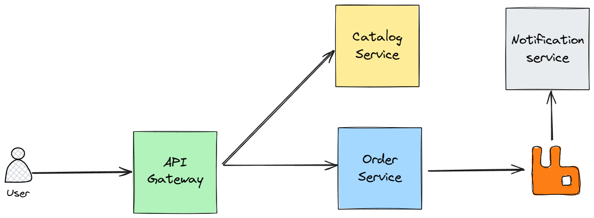

# Books E-Commerce Microservices

Spring Boot microservices for books e-commerce with event-driven architecture.

## Architecture

## Services

**API Gateway** (8989) - Spring Cloud Gateway

- Routes: `/catalog/**` → Catalog Service, `/orders/**` → Order Service
- CORS, load balancing

**Catalog Service** (8081) - Spring Boot + PostgreSQL (15432)

- Product CRUD, pagination, search
- REST API: `/api/products`

**Order Service** (8082) - Spring Boot + PostgreSQL (25432) + RabbitMQ

- Order management, event publishing
- Circuit breaker for Catalog Service calls
- REST API: `/api/orders`

**Notification Service** (8083) - Spring Boot + PostgreSQL (35432) + RabbitMQ

- Email notifications via SMTP
- Event-driven order notifications

## Tech Stack

- **Java 21**, Spring Boot, Spring Cloud Gateway
- **PostgreSQL 17** (database per service)
- **RabbitMQ** (messaging)
- **Flyway** (migrations), **Resilience4j** (circuit breaker)
- **Docker**, **Maven**, **JUnit 5**, **Testcontainers**

## Architecture Patterns

**Communication**:

- Synchronous: API Gateway → Services (HTTP/REST + Circuit Breaker)
- Asynchronous: RabbitMQ events for order notifications

**Data**: Database per service, Flyway migrations, eventual consistency

**Resilience**: Circuit breaker, retry, graceful shutdown, health checks

**Security**: CORS at gateway, username-based auth
